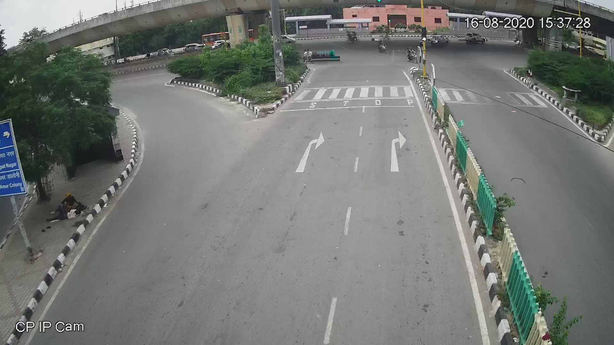
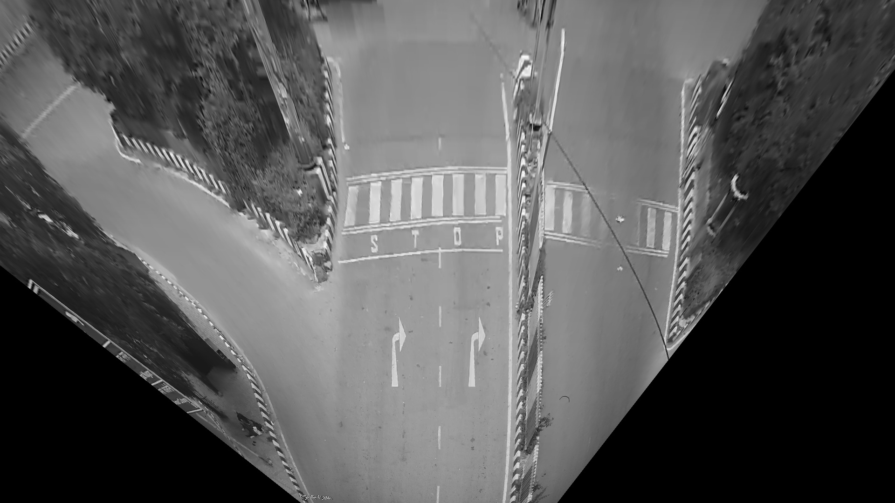
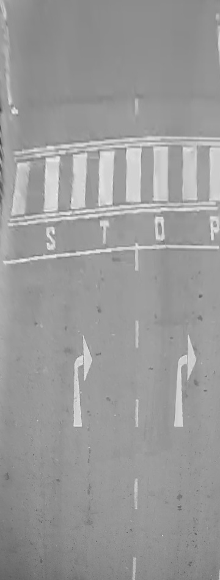
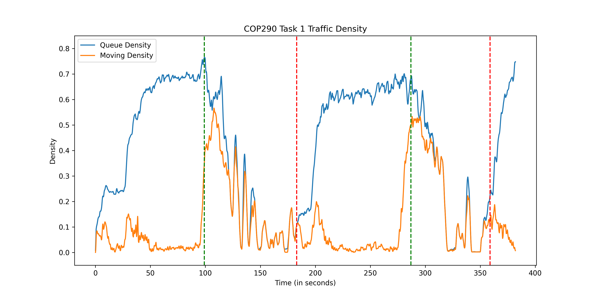
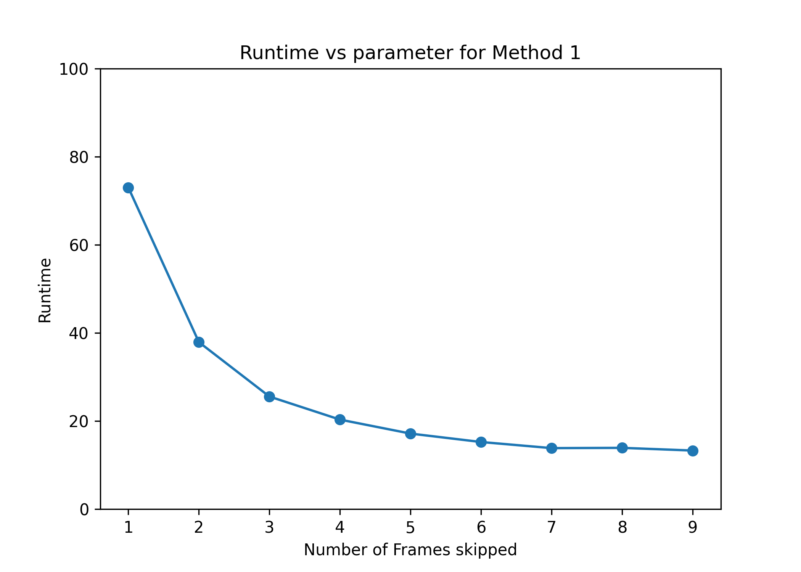
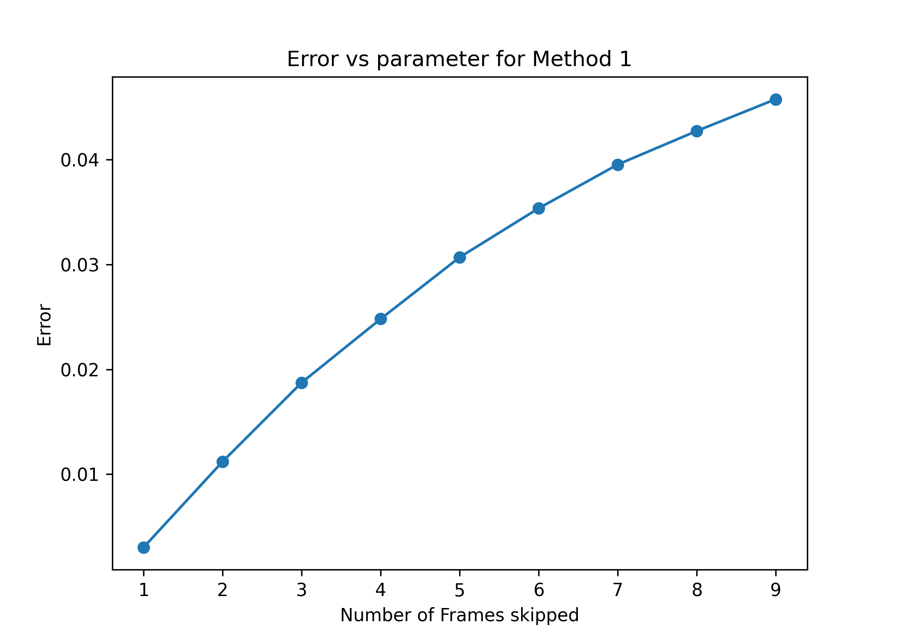
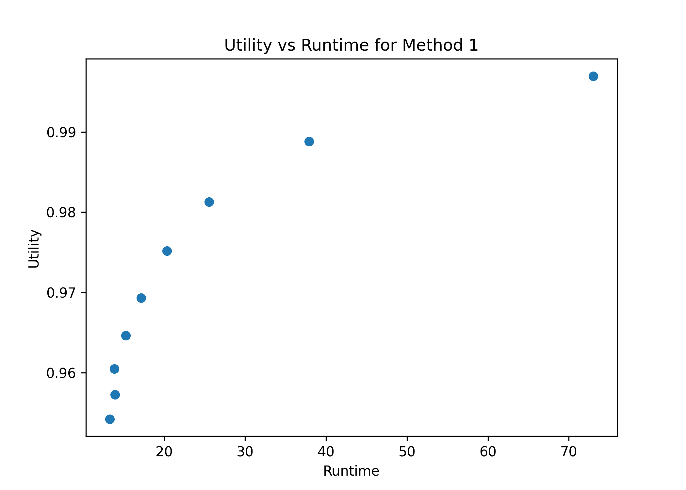

# Traffic Density Estimator

[Mustafa Chasmai](https://github.com/mustafa1728/) | [Tamajit banerjee](https://github.com/tamajit-banerjee)

Part of an assignment for the course COP290, 2021 by Prof. Rijurekha Sen. Course Website: [here](https://www.cse.iitd.ac.in/~rijurekha/cop290_2021.html).

## Part 1: Camera angle correction and frame cropping

Use homography transform to correct camera angle and then crop the warped image to get the region of interest. 

  
  
  
    From left to right: the original image, after being warped (corrected) and the final crop.

## Part 2: Queue and dynamic density estimation from traffic video

Queue density is density of all vehicles queued (either standing or moving) which are waiting for red signal in the straight stretch of road going towards north. Dynamic density is the density of those vehicles which are not standing but moving in that same stretch. From a camera view video of the road, we estimated the queue and dynamic density of traffic on that road as time passed. 

  
    Plot of the estimated queue and dynamic density for different frames in the video.

## Part 3: Queue and dynamic density estimation from traffic video

Further improving the latency or throughput of the algorithm using mult-threading and sub-sampling. Explored the various trade-offs involved in designing a real-life system. 

  
  
  
    

